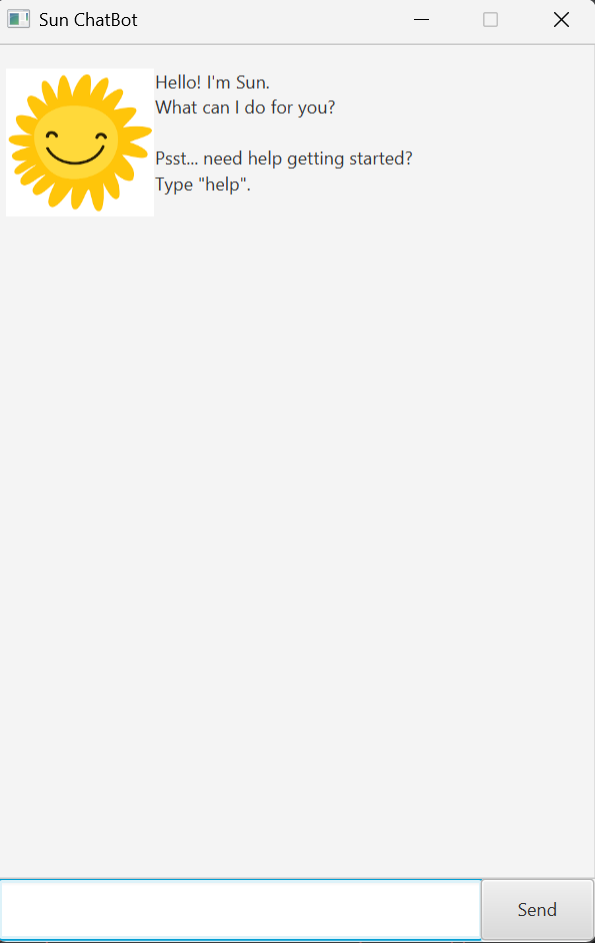
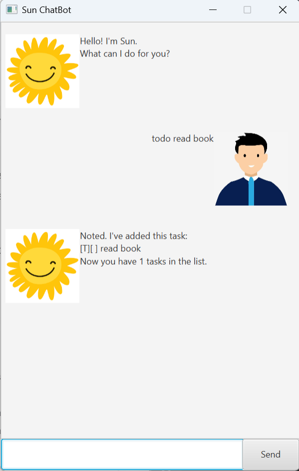
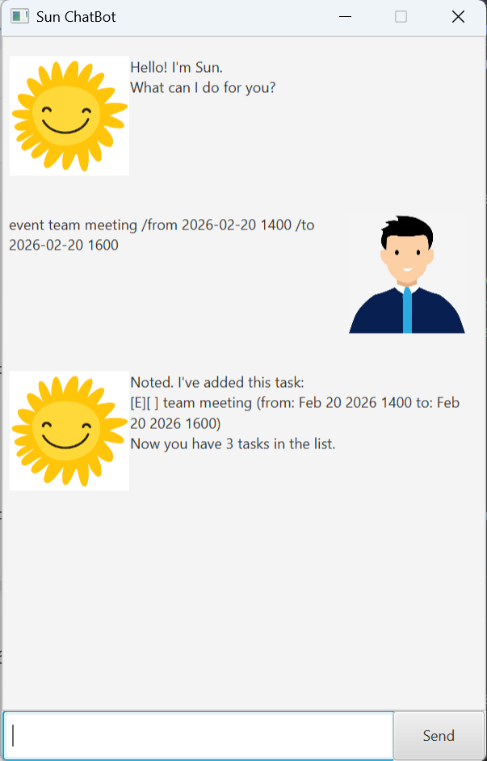
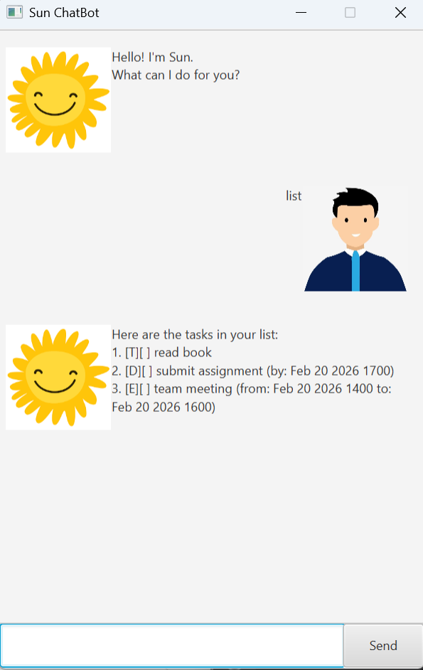
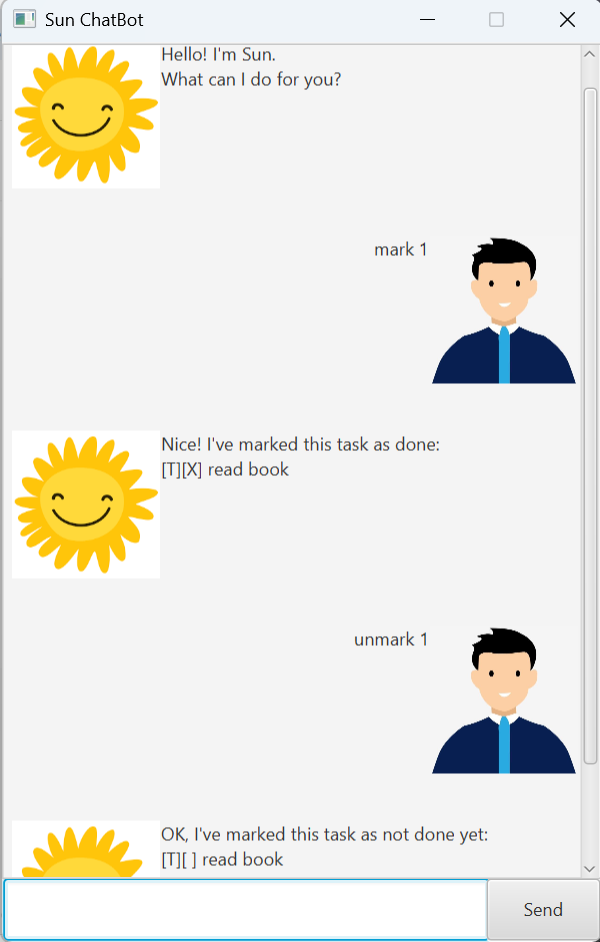
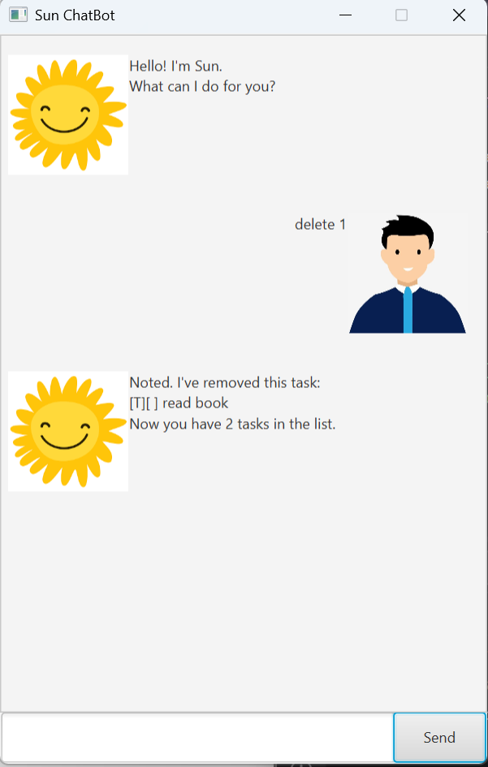
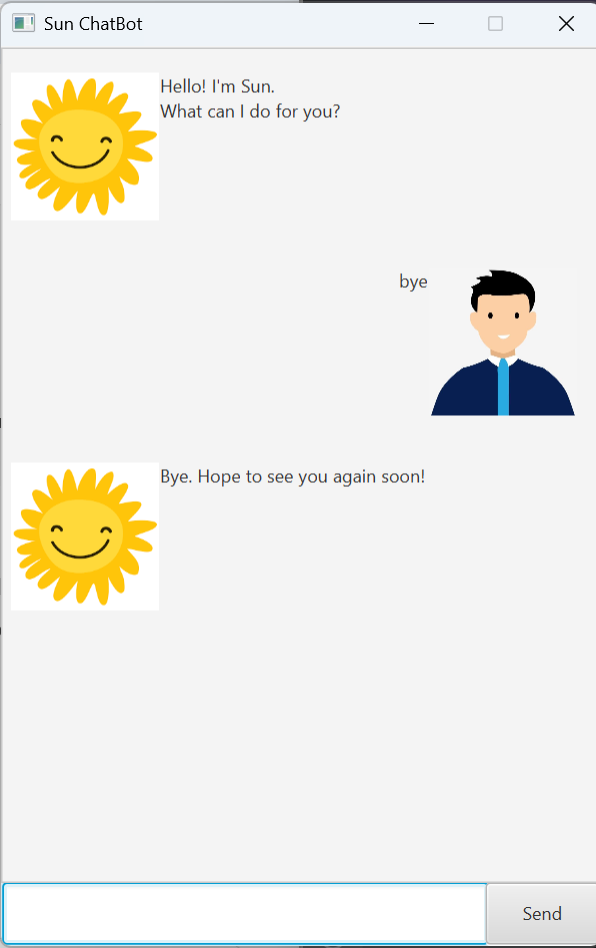

# Sun ChatBot User Guide



## Introduction
Sun ChatBot is a smart and interactive **task manager** that helps you organize your tasks, deadlines, and events effortlessly. 

Key features of Sun ChatBot:
- **Add tasks**: Create todos, deadlines, or events quickly.
- **Mark/Unmark tasks**: Designate tasks as completed or pending tasks.
- **Task overview**: View all your tasks in an organized list.
- **Delete tasks**: Remove tasks when they are no longer relevant.
- **Undo actions**: Undo mistakenly managed task.
- **Find tasks**: Search for specific tasks by keywords.


Sun ChatBot is designed for anyone who wants a **fast, friendly, and visual way** to keep their tasks organized.


## Adding Todo Tasks

The **Todo** feature allows you to quickly add a task that you want to complete, without specifying a deadline or event time.

This is useful for general tasks, reminders, or things you want to track.

Example: `todo read book`

After entering the command, the task will be added to the task list and a confirmation message will be shown.
```
Noted. I've added this task:
[T][ ] read book
Now you have 1 tasks in the list.
```

- `[T]` = Todo task


## Adding Deadline Tasks


The **Deadline** feature allows the user to add a task that must be completed by a specific date and/or time.  

The following date/time formats are allowed:
- `yyyy-MM-dd HHmm` (e.g., 2026-02-20 0900)
- `yyyy-MM-dd` (e.g., 2026-02-20)
- `HHmm` (e.g., 1800, assumes today’s date)

Example: `deadline submit assignment /by 2026-02-20 2359`

After entering the command, the deadline task will be added to the task list and a confirmation message will be shown.
```
Noted. I've added this task:
[D][ ] submit assignment (by: Feb 20 2026 23:59)
Now you have 2 tasks in the list.
```

- `[D]` = Deadline task


## Adding Event Tasks


The **Event** feature allows the user to add a task that occurs within a specific time period.  
You need to provide both a start and end time using the following formats:
- `yyyy-MM-dd HHmm` (e.g., 2026-02-20 1400)
- `yyyy-MM-dd` (e.g., 2026-02-20)
- `HHmm` (e.g., 1400, assumes today’s date)

Example: `event team meeting /from 2026-02-20 1400 /to 2026-02-20 1600`

After entering the command, the event task will be added to the task list and a confirmation message will be shown.
```
Noted. I've added this task:
[E][ ] team meeting (from: Feb 20 2026 14:00 to: Feb 20 2026 16:00)
Now you have 3 tasks in the list.
```
- `[E]` = Event task


## Listing Tasks


The **List** feature displays all tasks currently in your task list, showing their type, completion status, and description.

Example: `list`

After entering the command, the task list will be shown.
```
1. [T][ ] read book
2. [D][ ] submit assignment (by: Feb 20 2026 23:59)
3. [E][ ] team meeting (from: Feb 20 2026 14:00 to: Feb 20 2026 16:00)
```

- The numbers `1, 2, 3` indicate the **position of each task in your task list**.
- These numbers are used for commands like `mark`, `unmark`, and `delete` to reference a specific task.


## Marking & Unmarking Tasks


The **Mark** feature allows the user to mark a task as completed, while the **Unmark** feature allows the user to mark a task as not completed.

You reference the task by its number in the list.

### Mark a task

Example: `mark 1`

After entering the command, the task will be marked and a confirmation message will be shown.
```
Nice! I've marked this task as done:
[T][X] read book
```
- `[X]` = Completed

### Unmark a task

Example: `unmark 1`

After entering the command, the task will be unmarked and a confirmation message will be shown.
```
OK, I've marked this task as not done yet:
[T][ ] read book
```

- `[ ]` = Not completed


## Deleting Tasks


The **Delete** feature allows the user to remove a task from the task list.

You reference the task by its number in the list.

Example: `delete 1`

After entering the command, the task will be removed the task list and a confirmation message will be shown.
```
Noted. I've removed this task:
[T][ ] read book
Now you have 2 tasks in the list.
```


## Undoing Actions


The **Undo** feature allows the user to revert the most recent change to the task list.  
This is useful if a task was accidentally added, deleted, or marked/unmarked.

Example: `undo`

After entering the command, the most recent action will be undone and a confirmation message will be shown.
```
Undo Success!
```


## Finding Tasks


The **Find** feature allows the user to search for tasks containing a specific keyword.  
This is useful when you have many tasks and want to locate a specific one quickly.

Example: `find book`

After entering the command, the matching tasks will be displayed.
```
Here are the matching tasks in your list:
1. [T][ ] read book
```


## Closing the ChatBot


Once you are done managing your tasks, you can exit Sun ChatBot in one of two ways:

1. **Click the close button** on the window (the “X” at the top right).
2. **Type the command**: `bye`

Example: `bye`

After entering the command, the chat window will close gracefully after a short pause.

Thank you for using Sun ChatBot! 
We hope it helps you stay organized and manage your tasks efficiently.


